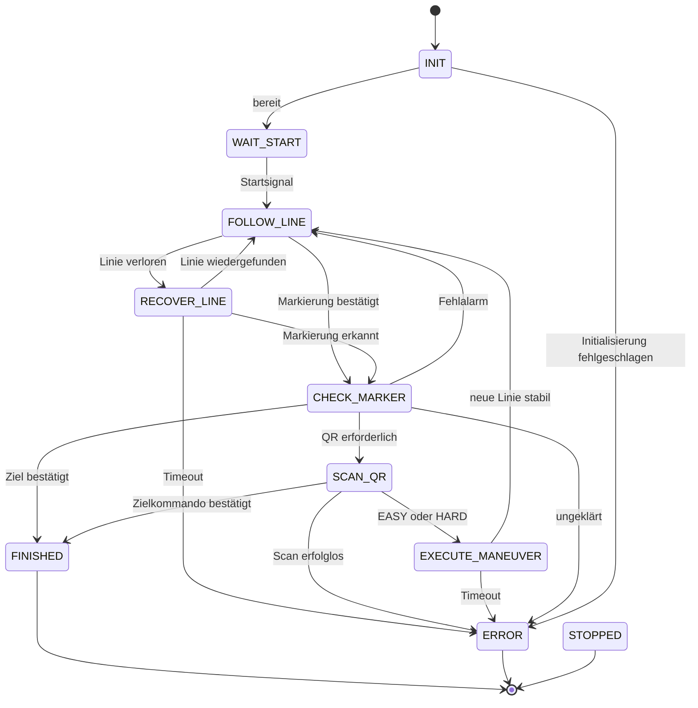

# Version 2: Zustandsbasierte Fahrzeugsteuerung

Status: Architektur- und Umsetzungsplan; noch keine Implementierung.

## Ziel und Ausgangslage

V2 steuert den PiCar über eine zentrale Zustandsmaschine. Linienfolge,
Kreuzungserkennung, QR-Auswertung und Fahrmanöver erhalten klare Verantwortlichkeiten.
Die Dateien in `Version 1/` bleiben als Referenz erhalten.

Die vorhandene `main.py` steuert den Ablauf über verschachtelte Schleifen und die
Flags `active`, `racing` und `notReady`. `curve_follower.py` enthält bereits eine
Zustandsmaschine, vermischt aber Sensoranalyse, Motorzugriff, Regelung und Ablauf.
Dieser Ansatz liefert Anregungen für V2, wird jedoch nicht unverändert übernommen.

Konkrete Probleme, die V2 beheben soll:

- `sleep()` in Fahrmanövern und QR-Scans unterbricht die laufende Reaktion auf Eingaben.
- `Picar.set_speed()` begrenzt negative Werte auf null; negative Geschwindigkeit
  allein erzeugt deshalb keine Rückwärtsbewegung.
- In `main.py` wird das Muster für `HARDLEFT` bereits von der vorherigen
  `LEFT`-Bedingung abgefangen.
- Die Bedeutung von vollständig aktiven/inaktiven Sensoren ist zwischen Kommentaren
  und Fahrvarianten nicht einheitlich. Die tatsächliche Polarität muss gemessen werden.
- Im Curve-Follower führen unbekannte QR-Texte, einschließlich des Texts für einen
  erfolglosen Scan, zum Zielzustand. Auch ein Recovery-Timeout wird als Ziel behandelt.
- Der Linienverlust wird dort anhand der Aufenthaltszeit im Fahrzustand geprüft,
  statt anhand der Dauer des tatsächlichen Linienverlusts.

## Fachlicher V2-Ablauf

Der verbindliche Ablauf für die erste V2 ist:

1. Das Fahrzeug wartet auf das definierte Startsignal.
2. Es folgt die Linie mit niedriger, konfigurierbarer Geschwindigkeit.
3. An einer bestätigten QR-Markierung hält es vollständig an.
4. Der QR-Code wird aus mehreren Kamerapositionen gelesen.
5. Der Inhalt wird exakt in eine Routenentscheidung übersetzt: `EASY` oder `HARD`.
6. Das Fahrzeug fährt das zugehörige, im Streckenprofil hinterlegte Manöver und folgt
   danach wieder der Linie.
7. Das Ziel wird nur durch ein bestätigtes Zielmuster oder einen definierten
   Ziel-QR-Code erkannt.

Das empfohlene QR-Format ist zunächst `ROUTE:EASY` beziehungsweise `ROUTE:HARD`.
`LEVEL 1` und `LEVEL 2` können als dokumentierte Aliase akzeptiert werden, dürfen
aber nicht über Teilstrings oder unbekannte Texte erkannt werden. Ein ungültiger,
fehlender oder widersprüchlicher QR-Code ist ein Fehler und niemals ein Zielsignal.

Die Routenentscheidung wird nach erfolgreichem Scan einmal gespeichert und bleibt bis
zum Ende des Manövers unverändert. Welche Abzweigung, Fahrtrichtung und maximale
Dauer zu `EASY` oder `HARD` gehören, steht in einem expliziten Streckenprofil statt
in verstreuten `if`-Bedingungen.

## Zustandsmodell

Ein `StateId`-Enum beschreibt den Ablauf. Sensorbefunde und QR-Kommandos bekommen
eigene Typen; beispielsweise ist `LEFT` eine Richtungsangabe, kein Betriebszustand.

| State | Aufgabe | Übergänge |
| --- | --- | --- |
| `INIT` | Hardware initialisieren, Konfiguration prüfen, Motoren stoppen | Bereit → `WAIT_START`; Fehler → `ERROR` |
| `WAIT_START` | Mit stehenden Motoren auf ein bestätigtes Startsignal warten | Start → `FOLLOW_LINE` |
| `FOLLOW_LINE` | Linie und Kurven anhand der aktuellen Sensorlage verfolgen | Bestätigte Markierung → `CHECK_MARKER`; anhaltender Linienverlust → `RECOVER_LINE` |
| `CHECK_MARKER` | Anhalten und Markierung anhand Verlauf und Streckenregeln bewerten | QR erforderlich → `SCAN_QR`; Fehlalarm mit gültiger Linie → `FOLLOW_LINE`; bestätigtes Ziel → `FINISHED`; ungeklärt/Timeout → `ERROR` |
| `SCAN_QR` | Im Stand Kamerapositionen schrittweise abfahren und QR lesen | `EASY`/`HARD` → `EXECUTE_MANEUVER`; bestätigtes Zielkommando → `FINISHED`; Versuche erschöpft/Kamerafehler → `ERROR` |
| `EXECUTE_MANEUVER` | Das zur gewählten Route gehörende Manöver über die Markierung fahren | Markierung verlassen und Ziellinie stabil gefunden → `FOLLOW_LINE`; Timeout → `ERROR` |
| `RECOVER_LINE` | Linie zeitlich begrenzt anhand der letzten bekannten Richtung suchen | Gültige Linie stabil gefunden → `FOLLOW_LINE`; Markierung erkannt → `CHECK_MARKER`; Timeout → `ERROR` |
| `FINISHED` | Erfolgreichen Abschluss melden, Motoren stoppen | Endzustand |
| `ERROR` | Fehler mit Ursache melden, Motoren stoppen | Endzustand |
| `STOPPED` | Benutzerabbruch behandeln, Motoren stoppen | Endzustand |

Benutzerabbruch führt aus jedem aktiven Zustand zu `STOPPED`, ein schwerer
Hardwarefehler zu `ERROR`. Endzustände starten nicht selbstständig erneut.
Fehler oder ein fehlender QR-Code sind niemals ein Zielnachweis.



Globale Fehler- und Abbruchübergänge sind zugunsten der Lesbarkeit nicht für jeden
State im Diagramm eingezeichnet.

Kurven benötigen zunächst keinen eigenen State: Die Linienregelung passt
Lenkung und Geschwindigkeit laufend an. Punktmuster werden erst als zusätzlicher
Ablauf aufgenommen, wenn ihre Bedeutung auf der Strecke geklärt ist.

## Ablauf eines Steuerungstakts

Als Ausgangswert sind 20 ms pro Takt vorgesehen; der Wert wird am Fahrzeug geprüft.
Zeitmessung erfolgt mit einer monotonen Uhr, die in Tests ersetzt werden kann.

1. Abbruch und Hardwarefehler prüfen; Sensoren einmal lesen und mit Zeitstempel versehen.
2. Sensorwerte normalisieren und daraus Linienposition sowie Markierungskandidaten bestimmen.
3. Den aktuellen State über `update(context, observation, now)` ausführen.
4. Einen angeforderten Wechsel zentral validieren, `exit()` und `enter()` aufrufen
   und den Wechsel einschließlich Ursache protokollieren.
5. Den für den neuen beziehungsweise verbleibenden State gültigen Motorbefehl
   anwenden; beim Wechsel niemals unbeabsichtigt den alten Fahrbefehl beibehalten.
6. Nur die verbleibende Taktzeit warten. Überläufe protokollieren.

`enter()` setzt Timer und lokale Zustandsdaten zurück; `exit()` beendet laufende
Aktionen. State-Handler enthalten keine eigenen Warteschleifen oder `sleep()`-Aufrufe.
Motorbefehle haben standardmäßig den Wert Stopp. Bei Abbruch, Fehler und Programmende
werden die Motoren unmittelbar gestoppt; Cleanup erfolgt auch bei teilweise
fehlgeschlagener Initialisierung und darf mehrfach aufgerufen werden.

Der QR-Scan erhält intern die Phasen Kamera ausrichten, Einschwingzeit abwarten und
Bild auswerten. Kameraaufnahme und Dekodierung laufen bei potenziell blockierenden
Aufrufen in einem begrenzten Worker außerhalb des Steuertakts. Dieser liefert nur
Ergebnisse; Servo- und Motorbefehle bleiben beim Steuerungsablauf. Es gibt höchstens
einen offenen Scanauftrag, eine Scan-ID gegen verspätete Ergebnisse und eine Deadline.
Bei Abbruch werden Ergebnisse verworfen und der Worker kontrolliert beendet; falls
der Kameratreiber nicht abbrechbar ist, ist ein separat beendbarer Prozess vorzusehen.

## Modulstruktur

Vorgesehener Einstieg: `python -m version2`.

```text
version2/
    __init__.py
    __main__.py             # Programmeinstieg
    app.py                  # Aufbau, Steuertakt, Abbruch und Cleanup
    config.py               # Typisierte Konfiguration und Plausibilitätsprüfung
    models.py               # StateId, Beobachtungen, QR-Kommandos, Motorbefehle
    state_machine.py        # Übergänge, enter/update/exit, Wechselprotokoll
    states/
        __init__.py
        base.py             # Gemeinsame State-Schnittstelle und Kontext
        lifecycle.py        # INIT, WAIT_START und Endzustände
        follow_line.py
        check_marker.py
        scan_qr.py
        execute_maneuver.py
        recover_line.py
    control/
        __init__.py
        line_controller.py  # Linienregelung ohne Hardwarezugriff
    perception/
        __init__.py
        line_analysis.py    # Polarität, Position, Muster und zeitliche Bestätigung
        qr_commands.py      # QR-Text in explizite Kommandos übersetzen
    hardware/
        __init__.py
        interfaces.py       # Austauschbare Fahrzeug- und Kameraschnittstellen
        picar.py            # GPIO/PWM, Sensoren, Servo, Motoren und Freigabe
        qr_camera.py        # Kameraaufnahme, Dekodierung und Worker-Lebenszyklus
tests/version2/
    fakes.py                # Simulierte Hardware und steuerbare Uhr
    test_line_analysis.py
    test_qr_commands.py
    test_state_machine.py
    test_scenarios.py
```

Hardware-Bibliotheken werden nur in den Adaptern geladen und Hardware wird erst
beim expliziten Programmstart initialisiert. Logiktests funktionieren ohne Raspberry Pi.
Ein State-Machine-Framework ist für diesen Umfang nicht erforderlich.

## Verhaltensregeln

- Sensorwerte werden auf `True = Linie erkannt` normalisiert. Die reale Polarität
  und Links-rechts-Reihenfolge werden vor dem Fahrtest kalibriert.
- Keine aktive Linie ergibt eine fehlende Linienposition, nicht Position null.
  Breite Markierungen werden vor der normalen Lenkregelung ausgewertet.
- Markierungen und wiedergefundene Linien müssen über eine konfigurierbare Dauer
  stabil sein. Linienverlust hat einen eigenen Timer.
- Nach einer Kreuzung wird ihre Erkennung erst wieder freigegeben, wenn die alte
  Markierung sicher verlassen wurde. Das verhindert wiederholte Scans am selben Ort.
- Ein Abbiegemanöver umfasst Ausfahrt aus der bisherigen Markierung und Suche nach
  der gewünschten Linie. Die noch sichtbare Eingangslinie darf es nicht sofort beenden.
- Die Linienregelung beginnt mit einer einfachen proportionalen Korrektur.
  PID-Erweiterungen folgen nur bei Bedarf; sie verwenden gemessenes `dt`, begrenzen
  das Integral und setzen ihren Verlauf beim Wiederbeginn der Linienfolge zurück.
- Motorbefehle enthalten vorzeichenbehaftete Sollwerte im Bereich `[-1, 1]`.
  Der Adapter übersetzt das Vorzeichen in Richtung und den Betrag in PWM;
  vor einem Richtungswechsel wird die Leistung auf null gesetzt.
- QR-Ergebnisse unterscheiden `FOUND`, `NOT_FOUND` und `ERROR`; der Parser
  unterscheidet gültige Kommandos und unbekannte Texte. Keine Substring-Regel
  interpretiert beliebige Inhalte als Ziel oder Abbiegung.
- Das verbindliche V2-Format ist `ROUTE:EASY` oder `ROUTE:HARD`.
  Aliase aus V1 (`level 1`, `level 2`) werden nur über eine explizite Tabelle
  unterstützt. `left` und `right` sind keine Routenentscheidung und werden nicht
  automatisch als gültige V2-Kommandos akzeptiert.
- Geschwindigkeiten, Zeitlimits, Scanpositionen, Servooffset und Erkennungszeiten
  liegen in `config.py`. Ungültige Konfiguration verhindert den Fahrtbeginn.

## Umsetzungsschritte und Abnahme

1. **Streckenregeln und Hardwareaufnahme:** Sensorpolarität, Startablauf,
   Kreuzungs-/Zielmuster und QR-Inhalte dokumentieren. Repräsentative Sensorfolgen
   als Testdaten erfassen.
2. **Grundgerüst:** Datenmodelle, Konfiguration, Hardware-Schnittstellen und
   Zustandsmaschine anlegen. Mit Fake-Hardware Start, Abbruch, Fehler und Cleanup prüfen.
3. **Linienfolge:** Sensoranalyse, proportionale Regelung und begrenzte Liniensuche
   implementieren. Alle 32 binären Sensormuster auf definierte Behandlung prüfen;
   Verlaufstests decken kurze Aussetzer und dauerhaften Linienverlust ab.
4. **Markierungen und QR:** Bestätigung, Scanphasen, Parser, Routenprofil und Manöver ergänzen.
   Erfolglose Scans, unbekannte Texte, verspätete Ergebnisse, wiederholte Markierungen
   und Manöver-Timeouts testen. Keine dieser Fehlerfolgen darf `FINISHED` auslösen.
5. **Fahrzeugtest:** Zunächst Motorzuordnung und Stoppen bei angehobenen Rädern prüfen,
   danach Start, Gerade, Kurven, Kreuzung und Ziel mit geringer Geschwindigkeit testen.
   Zeitparameter und Regelung anhand der Messungen abstimmen.

V2 ist abnahmebereit, wenn der vereinbarte Streckenablauf reproduzierbar funktioniert,
alle Übergänge samt Ursache nachvollziehbar sind und Abbruch oder Fehler in jedem
aktiven State zum Stopp führen. Tests müssen ausdrücklich auch Motorbefehle beim
Zustandswechsel und das Cleanup nach Initialisierungsfehlern prüfen.

## Noch festzulegende Streckenregeln

- Was löst den Start aus? Benötigt der Startbereich eine aktive Ausfahrt?
  Falls ja, wird dafür ein begrenzter Startabschnitt vor `FOLLOW_LINE` ergänzt.
- Wie unterscheiden sich Kreuzung, Linienlücke, Punktmuster und Ziel eindeutig?
- Welche QR-Texte kommen tatsächlich vor, und welche Bedeutung haben die Level?
- Welche konkrete Abzweigung und welches Ziellinien-Muster gehören zu `EASY` und `HARD`?
- Darf das Fahrzeug bei fehlendem QR-Code weiterfahren? Planannahme: Nach begrenzten
  Versuchen mit `ERROR` stoppen; eine andere Regel muss ausdrücklich festgelegt werden.

Diese Fragen blockieren das Grundgerüst nicht. Die zugehörigen Fahrregeln und ihre
Abnahmetests werden erst mit den bestätigten Streckeninformationen festgeschrieben.
