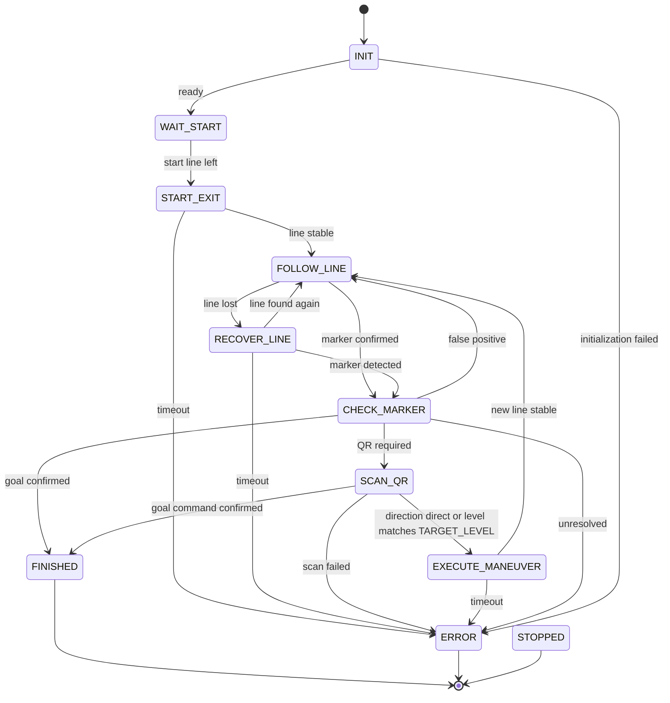

# Version 2: State-Based Vehicle Control

Status: Architecture and implementation plan; not implemented yet.

## Goal and Current State

V2 controls the PiCar through a central state machine. Line following,
intersection detection, QR evaluation, and driving maneuvers have clear responsibilities.
The files in `Version 1/` remain as reference material.

The existing `main.py` controls the process with nested loops and the flags `active`,
`racing`, and `notReady`. `curve_follower.py` already contains a state machine, but
mixes sensor analysis, motor access, control, and process management. V2 will use its
ideas without adopting it unchanged.

Specific problems V2 must solve:

- `sleep()` in driving maneuvers and QR scans interrupts the response to inputs.
- `Picar.set_speed()` clamps negative values to zero; negative speed alone therefore
  cannot drive the vehicle backwards.
- In `main.py`, the `HARDLEFT` pattern is already caught by the preceding `LEFT`
  condition.
- The meaning of fully active/inactive sensors is inconsistent between comments and
  driving variants. The actual polarity must be measured.
- In the curve follower, unknown QR text, including failed-scan text, leads to the
  goal state. A recovery timeout is also treated as a goal.
- Line loss is checked using time spent in the driving state instead of the duration
  of the actual line loss.

## V2 Functional Flow

The first V2 must follow this process:

1. The vehicle waits on a completely black start line with the motors stopped.
2. After leaving the start line, it drives slowly forward until the normal line is
   detected stably.
3. It follows the line at a low, configurable speed.
4. At a confirmed complete-black QR marker line, it stops completely.
5. The QR code is scanned from multiple camera positions. It contains either only a
   direction (`left` or `right`) or two text lines: level and direction.
6. For a two-line QR code, the level is read exactly and compared with the
   `TARGET_LEVEL` constant in the configuration.
7. If the level matches, or if the QR code contains only a direction, that direction
   is used as the maneuver and the corresponding track profile is executed. The
   vehicle then follows the line again.
8. The goal is recognized only through a confirmed goal pattern or a defined goal QR
   code.

The QR content has one of two valid formats:

- One line: `left` or `right`.
- Two lines: `level1` or `level2`, followed by `left` or `right`.

After normalizing case and line endings, the values are checked exactly. Substrings,
unknown levels, and other directions are invalid. An invalid or missing QR code is an
error and never proof of reaching the goal.

`TARGET_LEVEL` is validated during configuration and remains unchanged during a run.
The QR scanner returns a structured command with an optional `level` and `direction`.
When a level is present, the direction is used only if it matches `TARGET_LEVEL`.
Without a level, the direction is used directly. The branch, direction, sequence of
intersections, and maximum duration for each level belong in an explicit track profile,
not in scattered `if` statements.

## State Model

A `StateId` enum describes the process. Sensor observations and QR commands have
separate types; for example, `LEFT` is a direction, not an operating state.

| State | Responsibility | Transitions |
| --- | --- | --- |
| `INIT` | Initialize hardware, validate configuration, stop motors | Ready -> `WAIT_START`; error -> `ERROR` |
| `WAIT_START` | Wait with motors stopped on a completely black start line | Start line left -> `START_EXIT` |
| `START_EXIT` | Drive slowly forward until the normal line is detected stably | Line found -> `FOLLOW_LINE`; timeout -> `ERROR` |
| `FOLLOW_LINE` | Follow the line and curves using current sensor data | Confirmed complete-black QR marker -> `CHECK_MARKER`; persistent line loss -> `RECOVER_LINE` |
| `CHECK_MARKER` | Stop and evaluate the complete-black marker using history and track rules | QR required -> `SCAN_QR`; false positive with valid line -> `FOLLOW_LINE`; confirmed goal -> `FINISHED`; unresolved/timeout -> `ERROR` |
| `SCAN_QR` | Scan QR from multiple camera positions while stopped | Direction-only QR or matching level -> direction to `EXECUTE_MANEUVER`; confirmed goal command -> `FINISHED`; attempts exhausted/camera error -> `ERROR` |
| `EXECUTE_MANEUVER` | Execute the maneuver selected by the QR direction | Intersection left and target line stable -> `FOLLOW_LINE`; timeout -> `ERROR` |
| `RECOVER_LINE` | Search for the line for a limited time using the last known direction | Stable line found -> `FOLLOW_LINE`; marker detected -> `CHECK_MARKER`; timeout -> `ERROR` |
| `FINISHED` | Report successful completion and stop motors | Terminal state |
| `ERROR` | Report the cause and stop motors | Terminal state |
| `STOPPED` | Handle user cancellation and stop motors | Terminal state |

User cancellation leads from every active state to `STOPPED`; a serious hardware error
leads to `ERROR`. Terminal states do not restart automatically. An error or missing QR
code is never proof of reaching the goal.



Global error and cancellation transitions are omitted from the diagram for readability.

Curves do not initially need a separate state: the line controller continuously adjusts
steering and speed. Point patterns become a separate process only after their meaning
on the track has been clarified.

## Control Cycle

The initial target is 20 ms per cycle; this must be verified on the vehicle. Time is
measured with a monotonic clock that can be replaced in tests.

1. Check cancellation and hardware errors; read sensors once and timestamp them.
2. Normalize sensor values and derive line position and marker candidates.
3. Run the current state through `update(context, observation, now)`.
4. Validate the requested transition centrally, call `exit()` and `enter()`, and log
   the transition and its cause.
5. Apply the motor command valid for the new or remaining state; never unintentionally
   retain the old driving command across a transition.
6. Wait only for the remaining cycle time and log overruns.

`enter()` resets timers and local state; `exit()` ends active actions. State handlers
must not contain their own loops or `sleep()` calls. Motor commands default to stop.
On cancellation, error, and program exit, motors stop immediately. Cleanup also runs
after partial initialization failure and may be called repeatedly.

The QR scan internally has phases for moving the camera, waiting for it to settle, and
processing the image. Potentially blocking camera capture and decoding run in a bounded
worker outside the control cycle. The worker returns results only; servo and motor
commands remain in the control flow. At most one scan request may be open, with a scan
ID to reject late results and a deadline. On cancellation, results are discarded and
the worker is shut down in a controlled way. If the camera driver cannot be cancelled,
use a separately terminable process.

## Module Structure

Planned entry point: `python -m version2`.

```text
version2/
    __init__.py
    __main__.py             # program entry point
    app.py                  # setup, control cycle, cancellation, and cleanup
    config.py               # typed configuration and validation
    models.py               # StateId, observations, QR commands, motor commands
    state_machine.py        # transitions, enter/update/exit, transition logging
    states/
        __init__.py
        base.py             # shared state interface and context
        lifecycle.py        # INIT, WAIT_START, START_EXIT, and terminal states
        follow_line.py
        check_marker.py
        scan_qr.py
        execute_maneuver.py
        recover_line.py
    control/
        __init__.py
        line_controller.py   # line control without hardware access
    perception/
        __init__.py
        line_analysis.py     # polarity, position, patterns, and confirmation timing
        qr_commands.py       # translate QR text into explicit commands
    hardware/
        __init__.py
        interfaces.py        # replaceable vehicle and camera interfaces
        picar.py             # GPIO/PWM, sensors, servo, motors, and release
        qr_camera.py         # camera capture, decoding, and worker lifecycle
tests/version2/
    fakes.py                # simulated hardware and controllable clock
    test_line_analysis.py
    test_qr_commands.py
    test_state_machine.py
    test_scenarios.py
```

Hardware libraries are imported only in adapters, and hardware is initialized only
when the program is explicitly started. Logic tests run without a Raspberry Pi. A
state-machine framework is unnecessary for this scope.

## Behavior Rules

- Normalize sensor values to `True = line detected`. Calibrate the actual polarity and
  left-to-right order before driving tests.
- No active line means no line position, not position zero. Evaluate wide markers
  before normal steering control.
- Markers and recovered lines must remain stable for a configurable duration. Line
  loss has its own timer.
- A QR scan marker is a confirmed complete-black sensor line after the start area.
  Re-enable marker detection only after the old black line has definitely been left,
  preventing repeated scans at one location.
- A turn maneuver includes leaving the old marker and searching for the desired line.
  The still-visible entry line must not finish the maneuver immediately.
- Start line exit uses slow forward motion until the normal line is detected stably.
- Begin line control with a simple proportional correction. Add PID only if needed;
  use measured `dt`, limit the integral, and reset controller history when line
  following resumes.
- Motor commands use signed target values in `[-1, 1]`. The adapter translates the
  sign into direction and the magnitude into PWM; set power to zero before reversing.
- QR results distinguish `FOUND`, `NOT_FOUND`, and `ERROR`. The parser distinguishes
  valid commands from unknown text. No substring rule may interpret arbitrary content
  as a goal or turn.
- A V2 QR command is either a direction only (`left`, `right`) or two text lines:
  level (`level1`, `level2`) and direction (`left`, `right`). Both values are validated
  separately and stored in a structured command.
- `TARGET_LEVEL` in `config.py` selects the level for two-line QR codes. For a
  direction-only QR code, the direction is taken directly from the single value.
  Speeds, timeouts, scan positions, servo offset, and detection timings also belong in
  `config.py`. Invalid configuration prevents the vehicle from starting.

## Implementation and Acceptance

1. **Track rules and hardware survey:** document sensor polarity, start behavior,
   intersection/goal patterns, and QR contents. Record representative sensor sequences
   as test data.
2. **Foundation:** create data models, configuration, hardware interfaces, and the
   state machine. Test start, cancellation, errors, and cleanup with fake hardware.
3. **Line following:** implement sensor analysis, proportional control, and bounded
   line search. Define behavior for all 32 binary sensor patterns; sequence tests must
   cover short interruptions and persistent line loss.
4. **Black-line QR markers:** confirm complete-black markers, add scan phases, parser, route
   profiles, and maneuvers. Test failed scans, unknown text, late results, repeated
   markers, and maneuver timeouts. None of these failure paths may produce `FINISHED`.
5. **Vehicle test:** first verify motor mapping and stopping with the wheels lifted,
   then test start, straight sections, curves, intersections, and the goal at low
   speed. Tune timings and control from measurements.

V2 is ready for acceptance when the agreed track sequence works reproducibly, every
transition is traceable with its cause, and cancellation or errors stop the vehicle
from every active state. Tests must explicitly cover motor commands during transitions
and cleanup after initialization failures.

## Track Rules Still To Define

- The start signal is leaving a completely black start line. The duration required for
  stable start-line and exit detection still needs to be configured.
- How can a complete-black QR marker, line gap, other point patterns, and the goal be clearly
  distinguished?
- Which exact branch or intersection sequence belongs to each level and direction?
- What happens when a valid QR code has a level different from `TARGET_LEVEL`?
  Plan assumption: leave the intersection without a route maneuver and continue line
  following; alternatively, the track must define stopping as an error.
- May the vehicle continue after a missing QR code? Plan assumption: after a limited
  number of attempts, stop with `ERROR`; another rule must be explicitly defined.

These questions do not block the foundation. Their driving rules and acceptance tests
will be fixed after the track information is confirmed.
